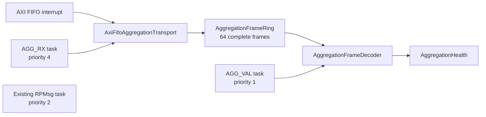

# R5C1 aggregation offload

This directory owns the modular R5C1 side of the staged interval-aggregation
offload. The first stage is deliberately observational: PL HLS records remain
authoritative while R5C1 proves that it receives every exact aggregation input
without corrupting or stalling the measurement path.

The private link is an exact co-release contract between the bitstream and R5C1
firmware. `AggregationProtocol::contract_revision` is only an image-integrity
guard against accidentally pairing different PL and RPU artifacts. There is no
protocol negotiation, legacy decoder, or compatibility fallback.

## Current shadow architecture



`main.cpp` only composes these long-lived objects and creates their tasks.
Ownership is intentionally split:

- `AggregationTransport` is the device-independent complete-frame interface.
- `AxiFifoAggregationTransport` alone owns XLlFifo and its interrupt.
- `AggregationFrameRing` is a statically allocated single-producer,
  single-consumer buffer. It contains no heap allocation.
- `AggregationFrameDecoder` validates the exact packet length, magic, contract
  guard, word count, sequence agreement, reserved bits, and CRC32C.
- `AggregationHealth` owns saturating validation and continuity counters.
- `AggregationShadowService` coordinates the input and validator tasks without
  knowing register layouts or performing aggregation arithmetic.

The ISR masks and acknowledges the receive-complete interrupt, then notifies
`AGG_RX`. The task drains every complete packet before rearming the interrupt;
it does not test `XLlFifo_IsRxDone()` after the ISR has already acknowledged
that condition. Parsing, CRC, and health updates occur in task context. A
malformed packet is discarded as a whole packet; R5C1 never aggregates across
a missing sequence.

## Packet contract

Each PL-to-R5C1 packet has 239 little-endian 32-bit words:

| Words | Meaning |
| --- | --- |
| 0 | Magic `0x31474741` (`AGG1` in little-endian bytes) |
| 1 | Fixed co-release contract guard |
| 2 | Payload word count, always 234 |
| 3 | Transport sequence, equal to payload word 0 |
| 4..237 | Exact 221-word SingleCycle packet followed by 13 context words |
| 238 | CRC32C over words 0..237 as little-endian bytes |

CRC32C uses reflected polynomial `0x82F63B78`, initial and final XOR
`0xFFFFFFFF`. The required `123456789` vector is `0xE3069283`.

## Staged cutover

1. **Shadow transport:** receive and validate packets while PL HLS aggregation
   remains authoritative.
2. **Host software port:** implement explicit `AggregationEngineState`, fixed
   integer math, interval finalization, and record formatting as separate
   classes; compare frozen 234-word traces byte-for-byte with HLS.
3. **Hardware shadow:** run the same engine on R5C1 and compare record identity
   metadata while PL records remain on the production DMA path.
4. **Authoritative output:** add a dedicated output task and complete-record
   software ring. The task writes one 256-byte record and one length to the AXI
   FIFO MM-S TX side per transaction.
5. **PL removal:** connect the FIFO M_AXIS directly to the existing meter AXIS
   switch, then remove the PL AggregationEngine and its MTR1/MTR2 FIFOs only
   after differential and target soak gates pass.

Future classes should keep the following separation:

```text
AggregationInputDecoder
    -> AggregationEngine
       -> AggregationMath
       -> AggregationRecordBuilder
          -> CompleteRecordRing
             -> AggregationOutputTask
```

The aggregation task must never wait for Linux, DMA, the AXIS switch, or the
TX FIFO. Only the output task owns the TX side. Measurement payloads stay off
RPMsg.

## Focused host test

Run from the RPU repository root:

```sh
bash R5c1/tests/run_aggregation_shadow_tests.sh
```

The test covers the known CRC vector, exact header/context decoding, every
validation failure, ring ordering/capacity, sequence wrap, gaps, repeats, and
out-of-order health accounting.
