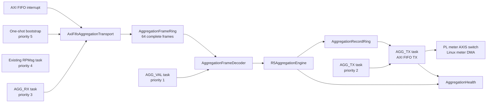

# R5C1 aggregation offload

This directory owns the modular R5C1 metrology-offload datapath. R5C1 is the
production authority: it receives complete private PL packets, validates and
dispatches them, performs interval and power-quality processing, then returns
complete meter records to the PL meter-DMA switch.

The private link is an exact co-release contract between the bitstream and R5C1
firmware. `AggregationProtocol::contract_revision` is only an image-integrity
guard against accidentally pairing different PL and RPU artifacts. There is no
protocol negotiation, legacy decoder, or compatibility fallback.

## Production architecture



`main.cpp` only composes these long-lived objects and creates their tasks.
Ownership is intentionally split:

- `AggregationTransport` is the device-independent complete-frame interface.
- `AxiFifoAggregationTransport` alone owns XLlFifo and its interrupt.
- `AggregationFrameRing` is a statically allocated single-producer,
  single-consumer buffer. It contains no heap allocation.
- `AggregationFrameDecoder` validates the exact packet length, magic, contract
  guard, word count, sequence agreement, reserved bits, and CRC32C.
- `AggregationHealth` owns saturating validation and continuity counters.
- `AggregationShadowService` coordinates the input and validator tasks without
  knowing register layouts or performing aggregation arithmetic.
- `aggregation_engine.cpp/.hpp` own the fixed-point interval algorithm and
  complete-record construction; `R5AggregationEngine` adapts that engine to
  the firmware lifecycle, transport, output ring, and health model.
- `AggregationRecordRing` decouples arithmetic from the FIFO transmit path.
- `AggregationOutputService` alone owns the FIFO TX side and retries a complete
  record when the downstream meter path applies backpressure.

The I/O tasks outrank arithmetic. `AGG_RX` drains at most four complete packets
per activation, notifies `AGG_VAL`, and then blocks for at least one RTOS tick.
R5C1 uses a 1 kHz FreeRTOS tick, so the bounded handoff has a 4,000-packet/s
ceiling. A compile-time rate budget requires at least 754 packets/s: the
685-packet/s worst case at 128 kSPS plus ten percent scheduling margin.
That bounded handoff is required because `taskYIELD()` cannot schedule a
lower-priority task. `AGG_TX` preempts `AGG_VAL` whenever a completed record is
ready, while `AGG_VAL` performs arithmetic only while both I/O owners are
blocked. RPMsg remains above all long-lived aggregation workers. A priority-5
one-shot task starts aggregation independently of Linux/RPMsg endpoint timing;
the RPMsg callback is an idempotent recovery path.

The ISR masks and acknowledges the receive-complete interrupt, then notifies
`AGG_RX`. The task removes no packet unless the software input ring has a free
slot, drains at most four complete packets, and then gives the validator a
deterministic scheduling interval. It does not test `XLlFifo_IsRxDone()` after
the ISR has already acknowledged that condition. Parsing, CRC, and health
updates occur in task context. A malformed packet is discarded as a whole
packet; R5C1 never aggregates across a missing sequence. Production builds
require both the hardware FIFO and its interrupt; the fixed one-millisecond
poll is a development-only fallback.

## Packet contracts

All packets use little-endian 32-bit words, a four-word header, and a final
CRC32C word. The dispatcher accepts these exact co-release contracts:

| Magic | Total words | Payload |
| --- | ---: | --- |
| `AGG1` | 239 | 221-word SingleCycle result plus 13 context words |
| `PQE1` | 69 | Half-cycle PQ-event sufficient statistics |
| `VSB1` rev. 1 | 1,043 | 256 signed-microvolt VA/VB/VC frames plus status, metadata, and trailer |
| `HRM1` | 2,693 | One byte-exact 42-record base-harmonic family |

The AGG1 frame is:

| Words | Meaning |
| --- | --- |
| 0 | Magic `0x31474741` (`AGG1` in little-endian bytes) |
| 1 | Fixed co-release contract guard |
| 2 | Payload word count, always 234 |
| 3 | Transport sequence, equal to payload word 0 |
| 4..237 | Exact 221-word SingleCycle packet followed by 13 context words |
| 238 | CRC32C over words 0..237 as little-endian bytes |

CRC32C uses reflected polynomial `0x82F63B78`, initial and final XOR
`0xFFFFFFFF`. The required `123456789` vector is `0xE3069283`.

VSB1 deliberately transports one shared raw-voltage batch instead of separate
engine-specific results. At the default 128-kSPS rate it produces 500 bounded
packets/s (about 2.09 MB/s). `VoltageSampleFrameDecoder` validates sample rate,
geometry, reserved bits, provenance, zero padding, and CRC without copying the
1,024 sample words. The validator fans that same immutable view to both power-
quality engines. `FlickerEngine` owns reference normalization, 2 kHz
decimation, seven IEC lamp-model filter sections, the 512-bin classifier, Pst,
Plt, and Flicker-v1 serialization. `MainsSignalEngine` owns the seven-probe
200 ms correlation bank, magnitude/background discrimination, carrier
centroid, and Mains-Signal-v1 serialization. It validates every raw sample but
bounds correlation arithmetic at 32 kSPS; that rate preserves the complete
characterized sub-12.5-kHz analogue band while allowing Flicker and mains
signalling to run together at the 128-kSPS ADC default. Their filter,
histogram, rolling Pst, and correlation state is statically allocated; no
packet-sized object is placed on a task stack. Rapid-voltage-change lifecycle
evaluation compares Urms(1/2) values one complete cycle apart because the
overlapping one-cycle RMS window settles a physical step over two half-cycle
updates.

## Authority and failure behavior

The production build uses `AggregationOutputMode::emit`. R5C1 owns the only
aggregation implementation, so there is only one source of Basic,
150/180-cycle, 10-minute, and 2-hour records. Each FIFO TX transaction contains
one complete 256-byte record and one asserted packet length/TLAST boundary.

The PL and R5C1 images are released together. If the FIFO is absent, input is
corrupt, the engine fails, or output cannot make progress, aggregation health
becomes unhealthy and the record path fails visibly. There is no runtime
fallback to a second PL aggregation authority. RPMsg remains responsive so
Linux can report the exact diagnostic counters.

Future classes should keep the following separation:

```text
AggregationInputDecoder
    -> AggregationEngine
       -> AggregationMath
       -> AggregationRecordBuilder
          -> CompleteRecordRing
             -> AggregationOutputTask
```

The aggregation task must never wait for Linux, DMA, the AXIS switch, or the
TX FIFO. Only the output task owns the TX side. Measurement payloads stay off
RPMsg.

## Focused host test

Run from the RPU repository root:

```sh
bash R5c1/tests/run_aggregation_shadow_tests.sh
```

The historical script name remains for compatibility. The test covers the
known CRC vector, exact header/context decoding, every validation failure,
ring ordering/capacity, sequence wrap, gaps, repeats, out-of-order health
accounting, complete-record emission, FIFO-output retry behavior, fixed
ten-minute demand, and sliding-demand warm-up/cadence/clean-refill recovery.
It also checks strict VSB1 decoding, shared Flicker raw processing, and the
mains-signalling estimator against an independent double-precision oracle at
every supported carrier-compatible sample rate. The event matrix includes a
physical 5% step reconstructed across consecutive Urms(1/2) updates so the
default 3% rapid-voltage-change profile cannot regress to adjacent-update
comparison.
