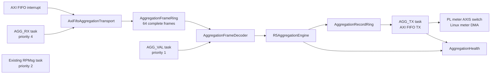

# R5C1 aggregation offload

This directory owns the modular R5C1 interval-aggregation datapath. R5C1 is
the production authority: it receives every complete PL SingleCycle input,
validates and aggregates it, then returns complete meter records to the PL
meter-DMA switch.

The private link is an exact co-release contract between the bitstream and R5C1
firmware. `AggregationProtocol::contract_revision` is only an image-integrity
guard against accidentally pairing different PL and RPU artifacts. There is no
protocol negotiation, legacy decoder, or compatibility fallback.

## Production architecture



`main.cpp` only composes these long-lived objects and creates their tasks.
Ownership is intentionally split:

- `AggregationTransport` is the device-independent complete-frame interface.
- `AxiFifoAggregationTransport` alone owns XLlFifo and its interrupt.
- `AggregationFrameRing` is a statically allocated single-producer,
  single-consumer buffer. It contains no heap allocation.
- `AggregationFrameDecoder` validates the exact packet length, magic, contract
  guard, word count, sequence agreement, reserved bits, and CRC32C.
- `AggregationHealth` owns saturating validation and continuity counters.
- `AggregationShadowService` coordinates the input and validator tasks without
  knowing register layouts or performing aggregation arithmetic.
- `R5AggregationEngine` owns interval state and complete-record construction.
- `AggregationRecordRing` decouples arithmetic from the FIFO transmit path.
- `AggregationOutputService` alone owns the FIFO TX side and retries a complete
  record when the downstream meter path applies backpressure.

The ISR masks and acknowledges the receive-complete interrupt, then notifies
`AGG_RX`. The task drains every complete packet before rearming the interrupt;
it does not test `XLlFifo_IsRxDone()` after the ISR has already acknowledged
that condition. Parsing, CRC, and health updates occur in task context. A
malformed packet is discarded as a whole packet; R5C1 never aggregates across
a missing sequence.

## Packet contract

Each PL-to-R5C1 packet has 239 little-endian 32-bit words:

| Words | Meaning |
| --- | --- |
| 0 | Magic `0x31474741` (`AGG1` in little-endian bytes) |
| 1 | Fixed co-release contract guard |
| 2 | Payload word count, always 234 |
| 3 | Transport sequence, equal to payload word 0 |
| 4..237 | Exact 221-word SingleCycle packet followed by 13 context words |
| 238 | CRC32C over words 0..237 as little-endian bytes |

CRC32C uses reflected polynomial `0x82F63B78`, initial and final XOR
`0xFFFFFFFF`. The required `123456789` vector is `0xE3069283`.

## Authority and failure behavior

The production build uses `AggregationOutputMode::emit`. The PL wrapper does
not elaborate its retained HLS aggregation reference, so there is only one
source of Basic, 150/180-cycle, 10-minute, and 2-hour records. Each FIFO TX
transaction contains one complete 256-byte record and one asserted packet
length/TLAST boundary.

The PL and R5C1 images are released together. If the FIFO is absent, input is
corrupt, the engine fails, or output cannot make progress, aggregation health
becomes unhealthy and the record path fails visibly. There is no runtime
fallback to a second PL aggregation authority. RPMsg remains responsive so
Linux can report the exact diagnostic counters.

Future classes should keep the following separation:

```text
AggregationInputDecoder
    -> AggregationEngine
       -> AggregationMath
       -> AggregationRecordBuilder
          -> CompleteRecordRing
             -> AggregationOutputTask
```

The aggregation task must never wait for Linux, DMA, the AXIS switch, or the
TX FIFO. Only the output task owns the TX side. Measurement payloads stay off
RPMsg.

## Focused host test

Run from the RPU repository root:

```sh
bash R5c1/tests/run_aggregation_shadow_tests.sh
```

The historical script name remains for compatibility. The test covers the
known CRC vector, exact header/context decoding, every validation failure,
ring ordering/capacity, sequence wrap, gaps, repeats, out-of-order health
accounting, complete-record emission, and FIFO-output retry behavior.
